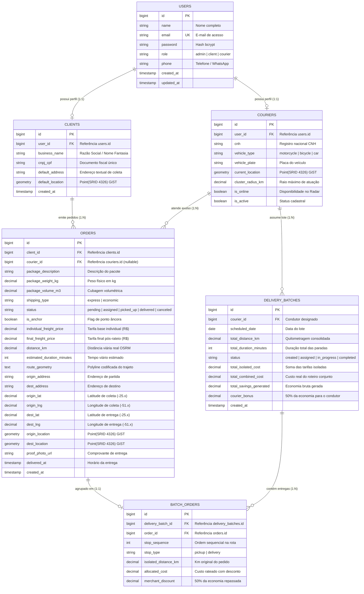
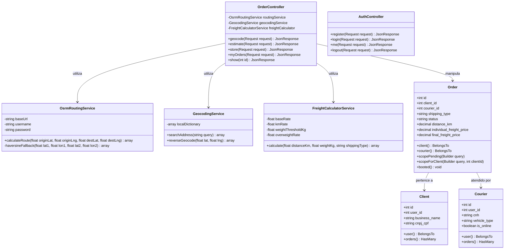
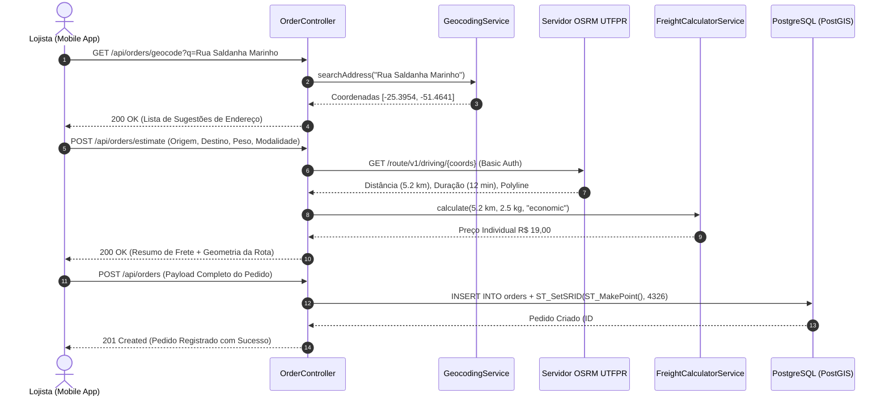
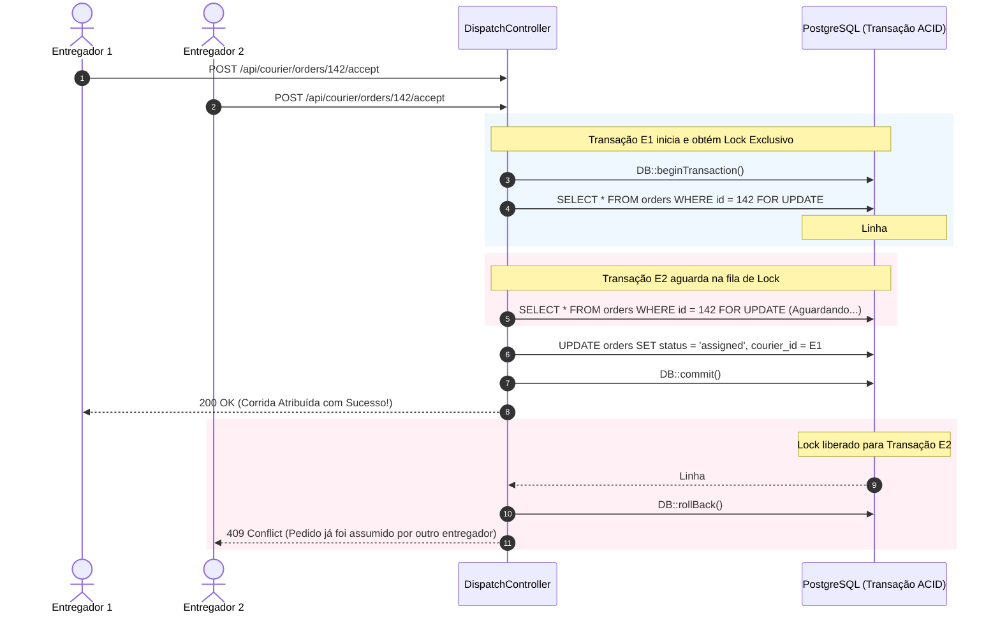

# 🐘 ZARPA Backend - API RESTful Geoespacial para Logística Urbana

> **Componente Curricular**: Desenvolvimento de Aplicações Backend com Framework  
> **Curso**: Tecnologia em Sistemas para Internet | **Instituição**: Universidade Tecnológica Federal do Paraná (UTFPR) – Câmpus Guarapuava  
> **Autor**: Leonardo Tosin  
> **Orientador / Docente**: Prof. Dr. Andres Jessé Porfirio  
> **Projeto Integrado**: Trabalho de Conclusão de Curso 2 (TCC 2)  
> **Repositório Público no GitHub**: [https://github.com/LeonardoTosinPR/Zarpa](https://github.com/LeonardoTosinPR/Zarpa)  
> **Protótipo no Figma**: [zarpa-entregas (UI/UX)](https://www.figma.com/design/TIzcx26iKkfJtdGsidStqD/zarpa-entregas?node-id=4-2&p=f)  
> **Branch de Desenvolvimento Ativa**: [`sprint/2-postagem-geocodificacao-pedidos`](https://github.com/LeonardoTosinPR/Zarpa/tree/sprint/2-postagem-geocodificacao-pedidos)

---

## 📑 Sumário

1. [Motivação do Projeto](#1-motivação-do-projeto)
2. [Objetivos do Sistema](#2-objetivos-do-sistema)
3. [Principais Funcionalidades Planejadas](#3-principais-funcionalidades-planejadas)
4. [Artefatos de Engenharia de Software](#4-artefatos-de-engenharia-de-software)
   - 4.1 [Modelagem do Banco de Dados (DER Geoespacial PostGIS)](#41-modelagem-do-banco-de-dados-der-geoespacial-postgis)
   - 4.2 [Diagrama de Classes da Aplicação Backend](#42-diagrama-de-classes-da-aplicação-backend)
   - 4.3 [Diagramas de Sequência dos Fluxos Críticos](#43-diagramas-de-sequência-dos-fluxos-críticos)
   - 4.4 [Levantamento e Priorização de Requisitos (MoSCoW & RICE)](#44-levantamento-e-priorização-de-requisitos-moscow--rice)
   - 4.5 [Planejamento Estratégico de Sprints](#45-planejamento-estratégico-de-sprints)
   - 4.6 [Prototipação de Telas e Integração de Interfaces](#46-prototipação-de-telas-e-integração-de-interfaces)
5. [Vídeo Explicativo da Ferramenta](#5-vídeo-explicativo-da-ferramenta)
6. [Arquitetura Tecnológica e Padrões de Projeto](#6-arquitetura-tecnológica-e-padrões-de-projeto)
7. [Instruções de Instalação e Execução com Docker](#7-instruções-de-instalação-e-execução-com-docker)
8. [Suíte de Testes Automatizados (Pest v3)](#8-suíte-de-testes-automatizados-pest-v3)

---

## 1. Motivação do Projeto

A logística urbana de última milha (*last-mile delivery*) em municípios de porte médio — como Guarapuava (PR) — enfrenta severos gargalos estruturais:

1. **Custos Abusivos e Ineficiência Ponto a Ponto**: Pequenos e médios comerciantes locais dependem de fretes individuais e fragmentados. Cada entrega gera uma corrida isolada, encarecendo o custo unitário e elevando o tráfego urbano.
2. **Intermediários Predatórios**: Plataformas consolidadas de entrega impõem taxas que variam de 20% a 30% sobre o valor dos produtos, sufocando as margens do comércio local e remunerando entregadores com valores desproporcionais ao esforço.
3. **Ausência de Otimização Geoespacial Colaborativa**: Inexistência de soluções acessíveis que calculem agrupamentos inteligentes de rotas (consolidação de pacotes em um mesmo vetor geográfico) compartilhando a economia de quilometragem entre as partes.

O **Zarpa** surge para transformar esse cenário através de uma **API RESTful de alta performance em Laravel 13** integrada a bancos de dados espaciais (**PostgreSQL 16 + PostGIS**) e motores de roteamento viário (**OSRM dedicado**). O sistema introduz o conceito inédito de **Lote Econômico com Rateio Dinâmico 50/50**, no qual múltiplos pedidos vizinhos são agrupados assincronamente e a economia gerada de quilometragem é dividida equitativamente: **50% convertida em desconto financeiro direto para os lojistas** e **50% repassada como bônus de produtividade para o condutor autônomo**.

---

## 2. Objetivos do Sistema

### Objetivo Geral
Projetar, modelar e implementar uma API RESTful escalável e robusta para intermediação inteligente de entregas urbanas, capaz de georreferenciar pontos, rotear trajetos viários reais, gerenciar concorrência estrita em tempo real e executar algoritmos de otimização e redistribuição colaborativa de frete.

### Objetivos Específicos
- **Modelagem Relacional e Espacial**: Estruturar schema no PostgreSQL com extensões **PostGIS (SRID 4326 - WGS 84)** e indexação espacial **GiST** para consultas ultra-rápidas de raio de cobertura e proximidade de pedidos.
- **Autenticação e RBAC Estrito**: Implementar controle de acesso baseado em papéis (*Role-Based Access Control*) com **Laravel Sanctum**, isolando fluxos de Lojista (`client`), Entregador (`courier`) e Administrador (`admin`).
- **Roteamento Viário Real e Geocodificação**: Integrar servidor de roteamento **OSRM próprio** (`https://osrmcar.debug.app.br`) com autenticação Basic Auth para cálculo exato de distâncias métricas e extração de geometria (Polyline), desacoplado de um serviço de geocodificação textual com fallback local resiliente.
- **Controle de Concorrência Transacional**: Desenvolver motor de despacho expresso com **bloqueio pessimista de linha (`lockForUpdate()`)** no banco de dados, eliminando corridas concorrentes (*race conditions*) durante o aceite instantâneo de pedidos no Radar.
- **Motor de Otimização de Lotes e Rateio 50/50**: Implementar serviço assíncrono para clusterização noturna de pedidos econômicos, aplicando formulação matemática determinística de rateio de custos e descontos.
- **Garantia de Qualidade de Software**: Cobrir 100% dos serviços de domínio, controllers e fluxos críticos com testes unitários e de integração utilizando o framework **Pest v3**.

---

## 3. Principais Funcionalidades Planejadas

| Módulo | Funcionalidade | Descrição Técnica no Backend |
| :--- | :--- | :--- |
| **Auth & Perfis** | Cadastro e Login Multiatriz | Endpoints `/api/auth/register` e `/api/auth/login` gerando tokens de acesso pessoal via Sanctum. Perfis especializados com validação de CNPJ/Razão Social para Lojistas e CNH/Veículo/Placa para Entregadores. |
| **Geo & Roteamento** | Geocodificação com Autocomplete | Endpoint `GET /api/orders/geocode` consumindo Nominatim com filtro estrito para Guarapuava - PR, suportado por catálogo geográfico local de alta disponibilidade. |
| **Geo & Roteamento** | Simulação e Cotação de Frete | Endpoint `POST /api/orders/estimate` que consulta o servidor OSRM, extrai a quilometragem viária e calcula tarifa base, custo por km e adicional de peso. |
| **Gestão de Pedidos** | Postagem de Pedido Geoespacial | Endpoint `POST /api/orders` que persiste coordenadas espaciais `origin_location` e `dest_location` com trigger automática PostGIS `ST_SetSRID(ST_MakePoint(), 4326)`. |
| **Radar Expresso** | Despacho Concorrente On-Demand | Endpoint transacional para aceite de corridas expressas com `lockForUpdate()`, garantindo que apenas um entregador assuma o pedido mesmo em requisições simultâneas. |
| **Lote Econômico** | Clusterização Noturna de Pacotes | Agrupamento heurístico de pedidos marcados como `economic` dentro de buffers geográficos, gerando a entidade `DeliveryBatch` com sequência otimizada de paradas. |
| **Financeiro** | Rateio Dinâmico 50/50 | Cálculo determinístico da economia de rota ($D_{isolada} - D_{conjunta}$), distribuindo 50% em descontos ponderados aos comércios e 50% em bonificação ao entregador. |
| **Auditoria & Status** | Ciclo de Vida da Entrega | Transição controlada de status (`pending` $\rightarrow$ `assigned` $\rightarrow$ `picked_up` $\rightarrow$ `delivered`), com upload de foto de comprovante e timestamp auditado. |

---

## 4. Artefatos de Engenharia de Software

### 4.1 Modelagem do Banco de Dados (DER Geoespacial PostGIS)

O schema do banco de dados foi projetado no PostgreSQL 16 utilizando extensões do **PostGIS** para armazenamento de tipos primitivos `geometry(Point, 4326)`.



---

### 4.2 Diagrama de Classes da Aplicação Backend

A arquitetura orientada a serviços e controllers segue o padrão clássico do ecossistema Laravel com injeção de dependência e responsabilidade única:



---

### 4.3 Diagramas de Sequência dos Fluxos Críticos

#### A. Fluxo de Criação e Roteamento de Pedidos (Sprint 2)
Demonstra o ciclo de resolução de endereços, cálculo OSRM e persistência transacional PostGIS:



#### B. Fluxo de Despacho Concorrente com Trava Pessimista (Sprint 3)
Garante que apenas o primeiro entregador que aceitar a corrida pelo Radar fique com o pedido:



---

### 4.4 Levantamento e Priorização de Requisitos (MoSCoW & RICE)

A matriz de requisitos do projeto foi estruturada com dupla validação de prioridade: a metodologia qualitativa **MoSCoW** (Must, Should, Could, Won't) e a métrica quantitativa **RICE** ($\text{Reach} \times \text{Impact} \times \text{Confidence} / \text{Effort}$):

| ID | Tipo | Requisito de Engenharia | MoSCoW | RICE Score | Módulo / Sprint |
| :--- | :--- | :--- | :--- | :--- | :--- |
| **RF 01** | Funcional | Autenticação RBAC e emissão de tokens de sessão Sanctum | **Must Have** | **6000** | Auth / Sprint 1 |
| **RF 02** | Funcional | Interface e endpoints de criação de pedidos com cubagem e peso | **Must Have** | **1800** | Orders / Sprint 2 |
| **RF 03** | Funcional | Geocodificação textual para coordenadas com delimitação urbana | **Must Have** | **2700** | Geo / Sprint 2 |
| **RF 04** | Funcional | Motor de roteamento viário OSRM com extração de Polylines | **Must Have** | **2400** | Geo / Sprint 2 & 3 |
| **RF 05** | Funcional | Algoritmo de clusterização e agrupamento em Lote Econômico | **Must Have** | **1600** | Batch / Sprint 4 |
| **RF 06** | Funcional | Motor de cálculo financeiro e rateio colaborativo 50/50 | **Must Have** | **1200** | Financial / Sprint 5 |
| **RF 07** | Funcional | Concorrência segura com bloqueio pessimista (`lockForUpdate`) | **Must Have** | **1800** | Dispatch / Sprint 3 |
| **RF 08** | Funcional | Agenda de paradas sequenciais e ciclo de vida de entrega | **Must Have** | **2000** | Delivery / Sprint 6 |
| **RF 09** | Funcional | Atualização manual de status e registro de comprovante | **Must Have** | **6000** | Delivery / Sprint 6 |
| **RF 10** | Funcional | Notificações de ofertas imediatas no Radar Expresso | **Should Have**| **1067** | Push / Sprint 3 |
| **RF 11** | Funcional | Painel de extrato transparente de economia e bonificação | **Should Have**| **1400** | Financial / Sprint 5 |
| **RF 12** | Funcional | Transbordamento nativo para navegação Google Maps e Waze | **Could Have** | **2000** | Mobile / Sprint 6 |
| **RNF 01**| Não-Func. | Persistência geoespacial nativa PostGIS com resposta < 1.5s | **Must Have** | — | Core / Sprint 0, 2 |
| **RNF 02**| Não-Func. | Isolamento transacional ACID e prevenção estrita de race conditions | **Must Have** | — | Core / Sprint 3 |
| **RNF 03**| Não-Func. | Compatibilidade multiplataforma do cliente (Expo SDK / Android) | **Must Have** | — | Mobile / Sprint 0-7 |
| **RNF 04**| Não-Func. | Latência média do roteamento externo OSRM < 2.5s | **Must Have** | — | Core / Sprint 2, 4 |

---

### 4.5 Planejamento Estratégico de Sprints

O desenvolvimento foi organizado em 8 sprints de entrega contínua com versionamento Git estrito por branches temáticas:

| Sprint | Período | Branch Git de Entrega | Foco Arquitetural e Entregáveis | Status |
| :--- | :--- | :--- | :--- | :---: |
| **Sprint 0** | 25/08 a 01/09/2026 | `sprint/0-setup-monorepo-infra-testes` | Infraestrutura Docker (PostGIS 16 + PHP 8.3), pipelines de teste (Pest/Jest), CLI unificado `run.sh`/`run.ps1`. | ✅ Concluída |
| **Sprint 1** | 02/09 a 09/09/2026 | `sprint/1-auth-perfis-atores` | Autenticação Sanctum, especialização de atores (`client`, `courier`, `admin`), seeders determinísticos de teste. | ✅ Concluída |
| **Sprint 2** | 10/09 a 17/09/2026 | `sprint/2-postagem-geocodificacao-pedidos` | Schema PostGIS `orders`, integração OSRM com Basic Auth, autocomplete geográfico, cálculo de frete e tela móvel de criação de pedido com Google Maps. | ✅ Concluída |
| **Sprint 3** | 18/09 a 25/09/2026 | `sprint/3-fluxo-expresso-concorrencia` | Motor de Radar Expresso, bloqueio pessimista `lockForUpdate()`, contagem regressiva de aceite e prevenção de conflitos. | 🔄 Em Execução |
| **Sprint 4** | 26/09 a 04/10/2026 | `sprint/4-lote-economico-agrupamento` | Algoritmo de roteamento multi-pontos OSRM, clusterização noturna e formação automatizada de lotes. | 📅 Planejada |
| **Sprint 5** | 05/10 a 13/10/2026 | `sprint/5-rateio-dinamico-extratos` | Módulo matemático de Rateio 50/50, persistência contábil e extratos de economia e bônus. | 📅 Planejada |
| **Sprint 6** | 14/10 a 22/10/2026 | `sprint/6-execucao-rotas-status-navegacao` | Agenda operacional do entregador, transição de status, upload de comprovante e deep links GPS. | 📅 Planejada |
| **Sprint 7** | 23/10 a 31/10/2026 | `sprint/7-validacao-cenarios-reais-homologacao` | Homologação integrada com malha urbana de Guarapuava, regressão completa e encerramento. | 📅 Planejada |

---

### 4.6 Prototipação de Telas e Integração de Interfaces

As telas e fluxos de usuário foram prototipados no **Figma**:

🔗 **Protótipo Interativo no Figma**:  
👉 [**zarpa-entregas (Design System & Telas Mobile)**](https://www.figma.com/design/TIzcx26iKkfJtdGsidStqD/zarpa-entregas?node-id=4-2&p=f)

A arquitetura do aplicativo móvel consome diretamente os endpoints RESTful desenvolvidos nesta disciplina, garantindo validação de payloads, feedback visual de erros e mapeamento de coordenadas em tempo real.

---

## 5. Vídeo Explicativo da Ferramenta

> ⚠️ **Nota de Avaliação**: O vídeo demonstrativo com duração de até 3 minutos apresentando a proposta técnica, objetivos e funcionalidades planejadas está em fase de gravação e será linkado publicamente abaixo:

- **Link Público do Vídeo**: [Assistir ao Vídeo Demonstrativo (YouTube / Google Drive - Acesso Público)](https://youtu.be/WZ_Gin2e_6U)
- **Tempo Máximo**: 3 minutos.
- **Tópicos Abordados no Vídeo**:
  1. Contextualização do problema de frete urbano em Guarapuava.
  2. Apresentação da arquitetura do Backend Laravel 13 com PostGIS e OSRM.
  3. Demonstração dos endpoints principais (`/api/orders/geocode`, `/api/orders/estimate` e criação de pedidos).
  4. Apresentação do modelo de rateio dinâmico 50/50.

---

## 6. Arquitetura Tecnológica e Padrões de Projeto

- **Linguagem & Framework**: PHP 8.3+ / **Laravel 13**
- **SGBD Relacional e Espacial**: **PostgreSQL 16** com extensão **PostGIS 3.4**
- **Autenticação**: **Laravel Sanctum** com tokens Bearer revogáveis
- **Roteamento Viário Externo**: **Open Source Routing Machine (OSRM)** hospedado em `https://osrmcar.debug.app.br` (Basic Auth)
- **Concorrência**: Transações de isolamento estrito com **bloqueio pessimista de linha (`SELECT ... FOR UPDATE`)**
- **Framework de Testes**: **Pest v3** (PHPUnit wrapper moderno)
- **Ambiente de Desenvolvimento**: Contêineres isolados via **Docker & Docker Compose**

---

## 7. Instruções de Instalação e Execução com Docker

O projeto dispõe do utilitário de terminal unificado (`./run.sh` para Linux/macOS ou `.\run.ps1` para Windows):

### 1. Clonar o Repositório
```bash
git clone https://github.com/LeonardoTosinPR/Zarpa.git
cd Zarpa
```

### 2. Inicializar o Ambiente Completo (Backend + Banco PostGIS)
```bash
./run.sh up
```
*O comando valida o `.env`, inicia os containers `zarpa_postgres` e `zarpa_backend`, e aguarda a saúde da conexão PostGIS na porta 8000.*

### 3. Executar Migrations e Seeders de Teste
```bash
./run.sh db:populate
```

### 4. Credenciais de Teste Pré-Configuradas

| Perfil | E-mail | Senha | Papel no Sistema |
| :--- | :--- | :--- | :--- |
| 👑 **Admin Master** | `admin@zarpa.com.br` | `admin123456` | Acesso total irrestrito |
| 🏪 **Lojista Teste** | `lojista@zarpa.com.br` | `lojista123456` | Comércio *Padaria Central Guarapuava* |
| 🛵 **Entregador Teste** | `entregador@zarpa.com.br` | `entregador123456` | Condutor *Carlos Motoboy* (Placa `BRA2E19`) |

---

## 8. Suíte de Testes Automatizados (Pest v3)

O backend possui suíte completa de testes automatizados com banco de dados dedicado e isolado (`zarpa_testing`), garantindo que a base de desenvolvimento não seja sobrescrita:

```bash
./run.sh test:backend
```

### Resultados da Execução dos Testes:
```
   PASS  Tests\Unit\ExampleTest
  ✓ basic unit test                                                      0.06s  

   PASS  Tests\Unit\FreightCalculatorServiceTest
  ✓ calculates freight accurately for standard package without overweight  0.01s  
  ✓ calculates freight with overweight fee when package exceeds 5kg      0.01s  

   PASS  Tests\Unit\GeocodingServiceTest
  ✓ resolves address using Nominatim API when available                  0.02s  
  ✓ uses local Guarapuava dictionary fallback when Nominatim fails       0.01s  

   PASS  Tests\Unit\OsrmRoutingServiceTest
  ✓ calculates route with successful OSRM HTTP response                  0.01s  
  ✓ falls back to haversine calculation when OSRM server is unreachable  0.01s  

   PASS  Tests\Feature\AuthTest
  ✓ can register a new client with merchant profile and coordinates      0.97s  
  ✓ can register a new courier with vehicle and driver license           0.03s  
  ✓ registration validates required fields according to role             0.03s  
  ✓ user can login successfully with seeded test credentials             0.03s  
  ✓ admin can login successfully and has full access                     0.03s  
  ✓ login fails with invalid password                                    0.03s  
  ✓ authenticated user can fetch me profile and logout                   0.03s  
  ✓ role middleware isolates client and courier access properly          0.04s  

   PASS  Tests\Feature\HealthTest
  ✓ healthcheck endpoint returns successful structure                    0.02s  

   PASS  Tests\Feature\OrderTest
  ✓ authenticated user can query geocoding endpoint for address autocomplete 0.40s  
  ✓ user can estimate route and freight pricing without creating order   0.03s  
  ✓ client can create an order successfully with PostGIS spatial persistence 0.03s  
  ✓ courier is forbidden from creating client delivery orders            0.03s  
  ✓ client can list their own orders with status filtering               0.03s  

  Tests:    21 passed (137 assertions)
  Duration: 1.89s
```

---
*Documentação desenvolvida em conformidade com as diretrizes acadêmicas da disciplina de Desenvolvimento de Aplicações Backend com Framework — UTFPR Câmpus Guarapuava.*
