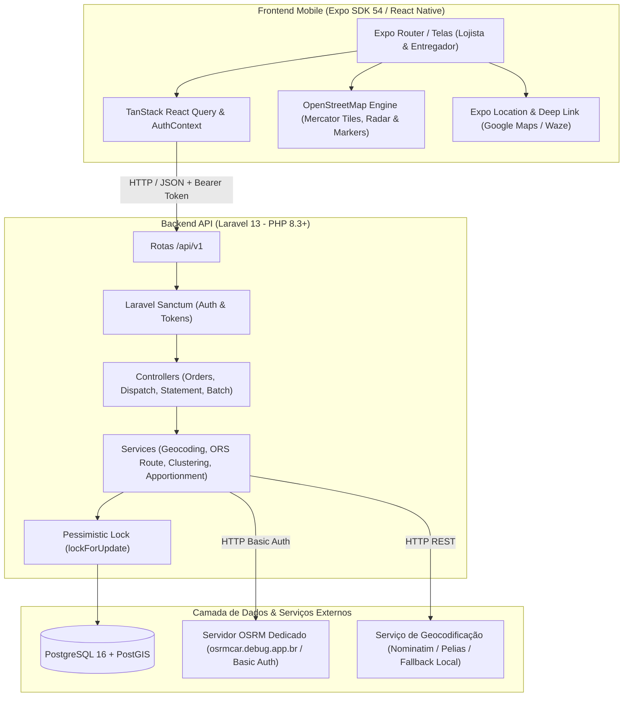
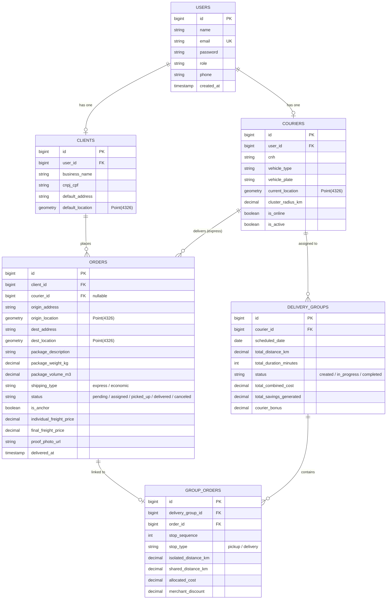

# ARQUITETURA DE SOFTWARE DO PROJETO ZARPA

## 1. Visão Geral da Arquitetura

O sistema Zarpa é desenhado sob o padrão arquitetural em camadas com separação clara entre cliente (Mobile React Native com Expo) e servidor (API RESTful em Laravel 13 com persistência relacional e geoespacial no PostgreSQL/PostGIS).

---

## 2. Componentes e Tecnologias

### 2.1 Backend (Laravel 13)
- **Framework**: Laravel 13 (PHP 8.3+).
- **Autenticação**: Laravel Sanctum com tokens de acesso pessoal e Policies por perfil (`client`, `courier`, `admin`).
- **Persistência**: PostgreSQL 16 + PostGIS (armazenamento de coordenadas geográficas `SRID 4326` com indexação espacial `GIST`).
- **Concorrência**: Controle transacional com bloqueio pessimista (`lockForUpdate()`) para disputa do Radar Expresso.
- **Roteamento Viário**: Integração HTTP com servidor OSRM próprio (`https://osrmcar.debug.app.br`) via Basic Auth.
- **Testes**: Pest v3 (Unit e Feature tests).

### 2.2 Frontend Mobile (React Native / Expo SDK 54)
- **Framework**: Expo SDK 54 com Expo Router (sistema de rotas baseado em arquivos).
- **Linguagem**: TypeScript.
- **Gerenciamento de Estado de Rede**: `@tanstack/react-query` e `axios`.
- **Armazenamento Seguro**: `expo-secure-store` para tokens JWT/Sanctum.
- **Mapas e Geolocalização**: Motor nativo em React Native puro consumindo API de azulejos do **OpenStreetMap (OSM)** com projeção Mercator determinística (eliminando dependência de SDKs proprietários/pagos do Google Maps) e `expo-location`.
- **Testes**: Jest + React Native Testing Library (RNTL).

### 2.3 Integrações Externas e Geoespaciais
- **Servidor OSRM Dedicado (`https://osrmcar.debug.app.br`)**:
  - Servidor próprio configurado para roteamento viário e cálculo de distâncias reais na malha urbana de Guarapuava - PR.
  - Autenticação: **HTTP Basic Auth** (configurado via variáveis de ambiente `OSRM_USERNAME` e `OSRM_PASSWORD`).
  - Endpoint principal: `GET /route/v1/driving/{coordinates}?steps=true&overview=full&geometries=polyline`.
  - Retorno: Distância precisa em metros, duração estimada em segundos e geometria da rota (Polyline) para renderização cartográfica.
- **Serviço de Geocodificação (`GeocodingService`)**:
  - Conversão de endereços textuais para coordenadas (lat/lng) com foco na área urbana de Guarapuava - PR.
  - Suporte a provedor Nominatim/Pelias com dicionário geográfico local de alta precisão (bairros e pontos de referência de Guarapuava) para garantia de disponibilidade nos testes unitários e E2E.
- **Navegação Nativa Externa**: Deep links para Google Maps (`geo:lat,lng`) e Waze (`waze://?ll=lat,lng&navigate=yes`).

---

## 3. Modelo de Dados Geográfico (DER Lógico)

---

## 4. Regra Matemática do Rateio Dinâmico 50/50

A economia total gerada pelo agrupamento de rotas em lote é calculada comparando a soma das distâncias individuais isoladas com a distância real consolidada do lote:

$$D_{isolada} = \sum_{i=1}^{n} d_i$$

$$E_{total} = (D_{isolada} \times \text{tarifa\_km}) - (D_{conjunta} \times \text{tarifa\_km})$$

A distribuição ocorre em proporção exata 50/50:
1. **Bônus de Produtividade do Entregador (50%)**:
   $$B_{courier} = E_{total} \times 0.50$$
2. **Desconto Compartilhado dos Lojistas (50%)**, rateado ponderadamente:
   $$\text{Desconto}_i = (E_{total} \times 0.50) \times \left( \frac{d_i}{D_{isolada}} \right)$$

