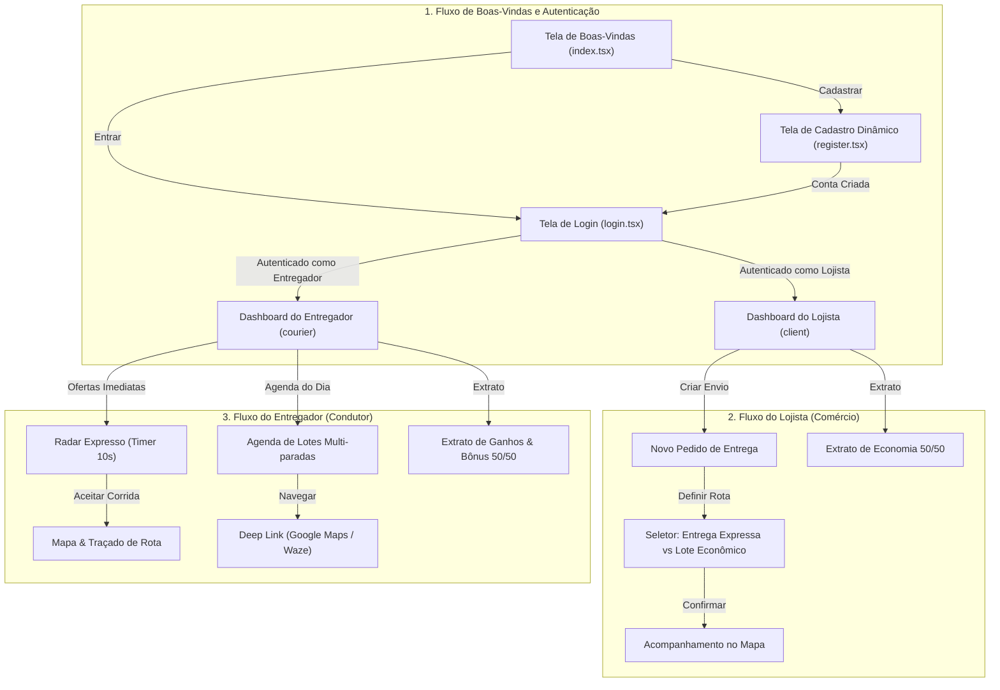
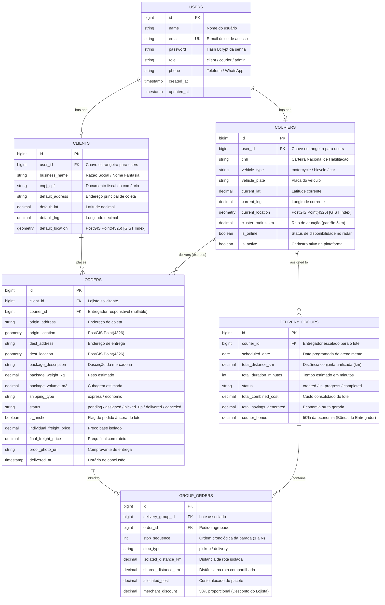

# 📱 ZARPA Mobile - Aplicativo Inteligente de Intermediação de Entregas Urbanas

> **Componente Curricular**: Desenvolvimento de Projetos para Dispositivos Móveis  
> **Curso**: Tecnologia em Sistemas para Internet | **Instituição**: UTFPR – Câmpus Guarapuava  
> **Autor**: Leonardo Tosin  
> **Orientador**: Prof. Dr. Andres Jessé Porfirio  
> **Projeto Integrado**: Trabalho de Conclusão de Curso 2 (TCC 2)  
> **Protótipo no Figma**: [zarpa-entregas (Figma UI/UX)](https://www.figma.com/design/TIzcx26iKkfJtdGsidStqD/zarpa-entregas?node-id=4-2&p=f)  
> **Repositório Público no GitHub**: [LeonardoTosinPR/Zarpa](https://github.com/LeonardoTosinPR/Zarpa)

---

## 📌 Sobre o App

O **Zarpa Mobile** é um aplicativo móvel multiplataforma (Android e iOS) desenvolvido com **React Native** e **Expo SDK 54**, voltado à intermediação inteligente de fretes urbanos no município de Guarapuava (PR). A plataforma conecta diretamente **Lojistas (Comércio Local)** a **Entregadores Autônomos (Couriers)**, eliminando intermediários predatórios e introduzindo um modelo inédito de **Lote Econômico com Rateio Dinâmico 50/50** baseado em otimização geoespacial.

O aplicativo oferece duas modalidades centrais de entrega:
1. **Entrega Expressa (On-Demand)**: Atendimento imediato e exclusivo com radar por proximidade geográfica e bloqueio pessimista de concorrência (`lockForUpdate()`), garantindo que apenas o primeiro entregador que aceitar a corrida assuma a rota.
2. **Lote Econômico (Rotas Compartilhadas)**: Agrupamento noturno automatizado de múltiplos pacotes compatíveis por proximidade de rota (PostGIS + OpenRouteService), repassando 50% da economia de quilometragem gerada como desconto aos lojistas e 50% como bônus financeiro de produtividade aos entregadores.

---

### 📋 Checklist de Funcionalidades do Projeto

Este checklist documenta a evolução contínua das funcionalidades nos checkpoints da disciplina:

#### 🚀 Funcionalidades Básicas (Prioritárias para o MVP)
- [x] **Setup do Monorepo & Infraestrutura Mobile**: Estrutura Expo SDK 54 compatível com Expo Go e emulador Android.
- [x] **Módulo de Atores e Autenticação Isolada**:
  - [x] Tela de Boas-Vindas com proposta de valor e seleção de perfil.
  - [x] Tela de Login unificada com validação e atalhos rápidos para teste.
  - [x] Tela de Cadastro dinâmico especializado para Lojista (CNPJ/Razão Social) e Entregador (CNH/Veículo/Placa).
  - [x] Gerenciamento de sessão com `AuthContext` e tokens seguros via `expo-secure-store`.
  - [x] Navegação condicional protegida por papéis (`(client)` e `(courier)`).
- [x] **Postagem de Pedidos & Geocodificação (Lojista - Sprint 2)**:
  - [x] Formulário de criação de entregas com ponto de coleta flexível (GPS, loja ou digitação).
  - [x] Geocodificação de endereços em coordenadas com autocomplete e debounce.
  - [x] Seletor visual de modalidade de frete (*Entrega Expressa* vs *Lote Econômico*).
  - [x] Visualização prévia da rota no mapa interativo com Google Maps (`react-native-maps`).
- [ ] **Radar Expresso & Disputa Concorrente (Entregador)**:
  - [ ] Tela de Radar de ofertas imediatas com contagem regressiva de 10 segundos.
  - [ ] Ação rápida "Aceitar Corrida" com feedback anti-colisão transacional.
  - [ ] Renderização fluida da Polyline da rota viária calculada pelo ORS.
- [ ] **Agenda de Lotes Econômicos & Execução Operacional**:
  - [ ] Visualização da agenda de paradas sequenciais de coleta e entrega.
  - [ ] Transições manuais de status do pedido (*Coletado*, *A caminho*, *Entregue*).
  - [ ] Transbordamento direto de rota (*Deep Linking*) para Google Maps (`geo:`) e Waze (`waze://`).
- [ ] **Extratos Financeiros com Rateio Dinâmico 50/50**:
  - [ ] Painel do Lojista exibindo o desconto obtido e economia acumulada.
  - [ ] Painel do Entregador detalhando faturamento base e bônus de rateio por lote.

#### 🔮 Funcionalidades Adicionais (Trabalhos Futuros / Pós-MVP)
- [ ] Upload e captura de foto/assinatura digital como comprovante de entrega no app.
- [ ] Notificações Push nativas em tempo real (Firebase Cloud Messaging / Expo Notifications).
- [ ] Rastreamento contínuo em tempo real com WebSockets / SSE do entregador em trânsito.
- [ ] Integração com gateway de pagamentos instantâneos (PIX automático).
- [ ] Sistema de avaliação mútua por estrelas entre lojistas e entregadores.

---

## 🎨 Protótipos de Tela

Todo o Design System, componentes visuais e fluxos de usuário foram prototipados no **Figma**:

🔗 **Link Público de Visualização no Figma**:  
👉 [**zarpa-entregas (Design System & Telas)**](https://www.figma.com/design/TIzcx26iKkfJtdGsidStqD/zarpa-entregas?node-id=4-2&p=f)

---

### 📱 Mapa e Fluxos de Telas do Aplicativo



---

### 🖼️ Principais Interfaces Modeladas no Figma

| Tela / Módulo | Descrição Visual e Operacional |
| :--- | :--- |
| **Boas-Vindas & Acesso** | Identidade visual da marca **⚡ Zarpa**, seletor de perfil e atalhos rápidos de teste (*Admin*, *Lojista*, *Entregador*). |
| **Login & Cadastro** | Validações com feedback de erro em tempo real e formulário condicional (CNPJ/Razão Social vs CNH/Veículo/Placa). |
| **Novo Pedido** | Inputs com autocomplete de endereços em Guarapuava, descrição da carga e peso total com cálculo de frete. |
| **Modo de Entrega** | Seleção entre **Entrega Expressa** (prioridade direta) e **Rota Econômica** (com rateio inteligente). |
| **Agenda de Rotas** | Timeline com cards ordenados de coleta e entrega, métricas de ganhos (`R$ 85,00`) e distância (`12 km`). |
| **Radar Expresso** | Card com contagem regressiva visual de 10s, ganho líquido, distância e botão de aceite rápido. |

---

## 🗄️ Modelagem do Banco de Dados

### Estratégia de Arquitetura e Persistência
O sistema adota uma arquitetura em camadas cliente-servidor desacoplada:
1. **Persistência Remota Geoespacial**:
   - Banco de dados relacional **PostgreSQL 16** com a extensão geoespacial **PostGIS (`postgis/postgis:16-3.4`)** ativada.
   - Gerenciado por uma API RESTful em **Laravel 13 (PHP 8.3+)** com autenticação baseada em tokens via **Laravel Sanctum**.
   - Armazenamento de geometrias espaciais em formato nativo `Point (SRID 4326)` com indexação espacial acelerada por árvores **`GIST`** para consultas de proximidade (`ST_DWithin`).
2. **Persistência Local no Aplicativo Mobile**:
   - Armazenamento encriptado no dispositivo móvel via **`expo-secure-store`** para tokens de sessão (Sanctum Bearer Token) e dados do perfil autenticado.
   - Gerenciamento de cache e revalidação de consultas de rede em memória via **`@tanstack/react-query`**.

---

### 📊 Diagrama Entidade-Relacionamento (DER Lógico)



---

## 📅 Planejamento de Sprints

O cronograma de desenvolvimento está estruturado em **8 sprints iterativas** ao longo do período de **25/08/2026 a 31/10/2026 (~9,5 semanas)**:

| Sprint | Período | Duração | Branch Git Obrigatória | Requisitos Mapeados | Foco Temático Principal | Status |
| :--- | :--- | :--- | :--- | :--- | :--- | :--- |
| **Sprint 0** | 25/08 a 01/09/2026 | 1,1 semana (8 dias) | `sprint/0-setup-monorepo-infra-testes` | RNF 01, RNF 03 | Monorepo, Docker PostgreSQL/PostGIS, Laravel 13, Expo SDK 54, Pest, Jest e Maestro | **✅ Concluída** |
| **Sprint 1** | 02/09 a 09/09/2026 | 1,1 semana (8 dias) | `sprint/1-auth-perfis-atores` | RF 01, RNF 03 | Autenticação Sanctum, Perfis Lojista/Entregador/Admin, SecureStore, Dashboards e CLI `run.ps1` | **✅ Concluída** |
| **Sprint 2** | 10/09 a 17/09/2026 | 1,1 semana (8 dias) | `sprint/2-postagem-geocodificacao-pedidos` | RF 02, RF 03, RNF 01 | Postagem de Pedidos, Geocodificação ORS em Guarapuava e Mapa Interativo | **🔄 A Seguir** |
| **Sprint 3** | 18/09 a 25/09/2026 | 1,1 semana (8 dias) | `sprint/3-fluxo-expresso-concorrencia` | RF 05, RF 07, RF 10, RNF 02 | Radar Expresso On-Demand com timer de 10s e Trava Pessimista anti-conflito (`lockForUpdate`) | **📅 Planejada** |
| **Sprint 4** | 26/09 a 04/10/2026 | 1,3 semana (9 dias) | `sprint/4-lote-economico-agrupamento` | RF 04, RF 05, RNF 01 | Lote Econômico Noturno (Batch), Clusterização Geoespacial e Rotas Multi-paradas ORS | **📅 Planejada** |
| **Sprint 5** | 05/10 a 13/10/2026 | 1,3 semana (9 dias) | `sprint/5-rateio-dinamico-extratos` | RF 06, RF 11 | Motor de Rateio Financeiro 50/50 e Painéis de Extrato Transparente para Lojistas e Entregadores | **📅 Planejada** |
| **Sprint 6** | 14/10 a 22/10/2026 | 1,3 semana (9 dias) | `sprint/6-execucao-rotas-status-navegacao` | RF 08, RF 09, RF 12 | Agenda de Rotas Operacionais, Ciclo de Vida do Pedido e Transbordamento GPS (Google Maps/Waze) | **📅 Planejada** |
| **Sprint 7** | 23/10 a 31/10/2026 | 1,3 semana (9 dias) | `sprint/7-validacao-cenarios-reais-homologacao` | Todos (RF 01 a 12, RNF 01 a 04) | Validação com Rotas Reais de Guarapuava, Regressão E2E Maestro e Congelamento do MVP | **📅 Planejada** |

---

## 🛠️ Stack Tecnológica Mobile

| Categoria | Tecnologia / Biblioteca | Finalidade no Projeto |
| :--- | :--- | :--- |
| **Framework Base** | [React Native](https://reactnative.dev/) (0.76+) | Criação de interface nativa multiplataforma Android/iOS |
| **Tooling & Runtime** | [Expo SDK 54](https://expo.dev/) (compatível com Expo Go) | Runtime moderno de desenvolvimento e acesso a APIs nativas |
| **Roteamento** | [Expo Router (v4)](https://docs.expo.dev/router/introduction/) | Roteamento baseado em arquivos (*file-based routing*) |
| **Linguagem** | [TypeScript](https://www.typescriptlang.org/) (5.x) | Tipagem estrita de contratos de dados e componentes |
| **Estado & Cache API**| [@tanstack/react-query](https://tanstack.com/query/latest) + [Axios](https://axios-http.com/) | Cache de requisições, mutações otimistas e sincronização |
| **Armazenamento Seguro**| `expo-secure-store` | Persistência criptografada de tokens Sanctum |
| **Mapas & GPS** | `react-native-maps` + `expo-location` | Renderização de mapas, marcadores de coleta/entrega e GPS |
| **Navegação Externa** | `expo-linking` | Deep linking nativo para Google Maps (`geo:`) e Waze (`waze://`) |
| **Testes Unitários** | [Jest](https://jestjs.io/) + [React Native Testing Library](https://callstack.github.io/react-native-testing-library/) | Testes de componentes, hooks e fluxos de tela |
| **Testes End-to-End** | [Maestro](https://maestro.mobile.dev/) | Automação E2E em linguagem declarativa YAML |

---

## 📂 Estrutura de Diretórios do Módulo Mobile

```
mobile/
├── app/                          # Rotas e Telas do Aplicativo (Expo Router)
│   ├── _layout.tsx               # Root Layout com Provedores Globais (Auth, Theme, React Query)
│   ├── index.tsx                 # Tela de Boas-Vindas e Redirecionamento de Sessão
│   ├── login.tsx                 # Tela de Login com atalhos de teste
│   ├── register.tsx              # Tela de Cadastro dinâmico (Lojista / Entregador)
│   ├── (client)/                 # Grupo de rotas protegidas do Lojista
│   │   ├── _layout.tsx           # Layout da área do Lojista
│   │   └── dashboard.tsx         # Dashboard e visão geral do comércio
│   └── (courier)/                # Grupo de rotas protegidas do Entregador
│       ├── _layout.tsx           # Layout da área do Entregador
│       └── dashboard.tsx         # Dashboard com switch Online/Offline e rota do dia
├── src/
│   ├── components/               # Componentes UI reutilizáveis (Header, Button, Input, RoleSelector)
│   ├── constants/                # Constantes do Design System (theme.ts: cores, fontes, sombras)
│   ├── context/                  # Contextos globais (AuthContext.tsx)
│   ├── services/                 # Clientes HTTP e persistência segura (api.ts, authStorage.ts)
│   ├── types/                    # Contratos de tipos TypeScript (auth.ts)
│   └── utils/                    # Funções utilitárias (formatação de moeda BRL, cálculos)
├── assets/                       # Ícones, splash screens e marcadores de mapa
├── __tests__/                    # Suíte de testes unitários com Jest e RNTL
├── app.json                      # Configurações do Expo
├── jest.config.js                # Configuração do Jest
├── package.json                  # Dependências e scripts npm
└── tsconfig.json                 # Configurações do TypeScript
```

---

## ⚡ Guia de Execução e Testes

### 🚀 Inicialização Rápida via CLI Unificado (Recomendado)
Na raiz do projeto (`d:\Zarpa`):
- **PowerShell**:
  ```powershell
  .\run.ps1 dev
  ```
- **Bash / WSL**:
  ```bash
  ./run.sh dev
  ```

### 📱 Execução Manual do Mobile
```bash
cd mobile
npm install
npx expo start
```
- Pressione **`a`** no terminal para executar no **Emulador Android**;
- Ou abra o app **Expo Go** no smartphone físico e escaneie o QR Code.

### 🧪 Execução dos Testes Automatizados
```bash
cd mobile
npm test
npx tsc --noEmit
```
